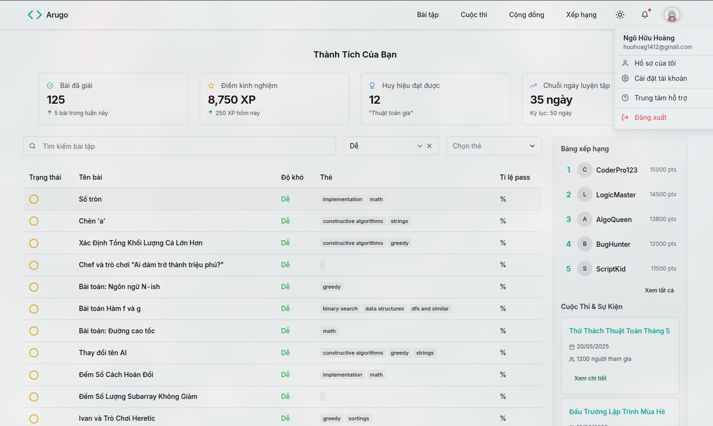
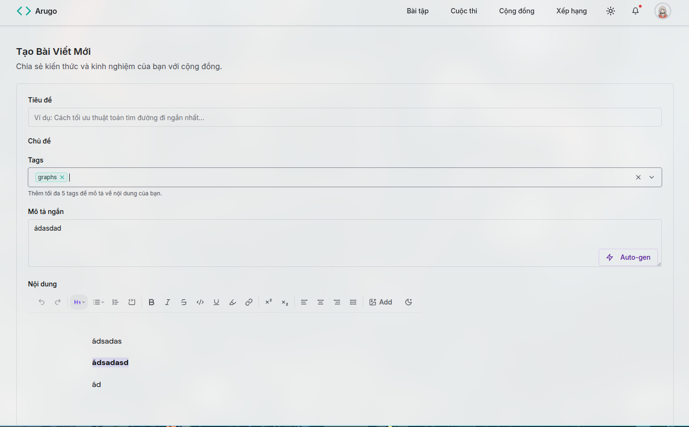
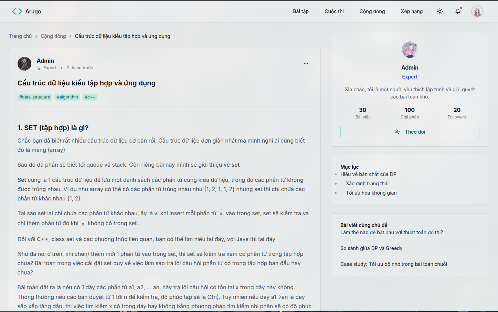

# Arugo 🚀

A modern competitive programming platform built with TypeScript, featuring real-time code execution, AI-powered code review, and comprehensive contest management.

## ✨ Features

- **🧩 Problem Solving**: Extensive library of coding problems with multiple difficulty levels
- **🏆 Contests**: Organized programming contests with leaderboards and rankings
- **🤖 AI Code Review**: Intelligent code analysis and scoring using multiple AI providers
- **⚡ Real-time Execution**: Live code testing with immediate feedback
- **📝 Rich Text Editor**: TipTap-based editor with syntax highlighting
- **👥 User Management**: Complete authentication and user profile system
- **📊 Analytics**: Detailed submission history and performance tracking
- **🎯 Multi-language Support**: Support for various programming languages

## 🛠️ Tech Stack

### Frontend
- **Framework**: TanStack Start for SSR + React
- **Styling**: Chakra UI v3 + Emotion
- **Build Tool**: Vite
- **Type Safety**: TypeScript
- **State Management**: TanStack Query + Zustand
- **Editor**: TipTap

### Backend
- **Runtime**: Bun
- **Framework**: Hono
- **API**: tRPC
- **Database**: PostgreSQL with Drizzle ORM
- **Authentication**: Better Auth
- **Message Queue**: NATS
- **AI Integration**: Multiple providers (OpenAI, Google AI, Mistral, etc.)

### DevOps & Tools
- **Monorepo**: Turborepo
- **Package Manager**: pnpm
- **Linting**: ESLint + Prettier
- **Database Migrations**: Drizzle Kit

## 🚀 Getting Started

### Prerequisites

- Node.js 18+
- pnpm 10.14.0+
- PostgreSQL database
- Bun runtime

### Installation

1. **Clone the repository**
   ```bash
   git clone https://github.com/Mirai3103/code-stack.git
   cd code-stack
   ```

2. **Install dependencies**
   ```bash
   pnpm install
   ```

3. **Environment Setup**
   - Copy `.env.example` to `.env` in each app/package that requires it
   - Configure database connection strings
   - Set up AI provider API keys
   - Configure authentication providers

4. **Database Setup**
   ```bash
   # Generate database schema
   pnpm run drizzle:generate
   
   # Push schema to database
   pnpm run drizzle:push
   ```

5. **Development**
   ```bash
   # Start all services in development mode
   pnpm dev
   
   # Or start specific services
   pnpm dev --filter=ui      # Frontend only
   pnpm dev --filter=server  # Backend only
   ```

The application will be available at:
- Frontend: `http://localhost:3000`
- Backend API: `http://localhost:8000`
- Database Studio: `pnpm drizzle:studio`

## Demo screen

[](https://res.cloudinary.com/dkvga054t/video/upload/v1754073274/cursorful-video-1754072797070_bw4czb.mp4)




